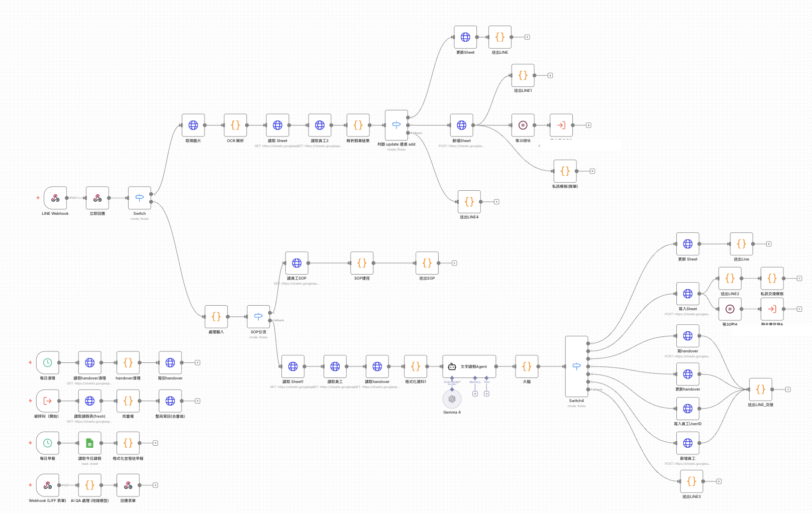
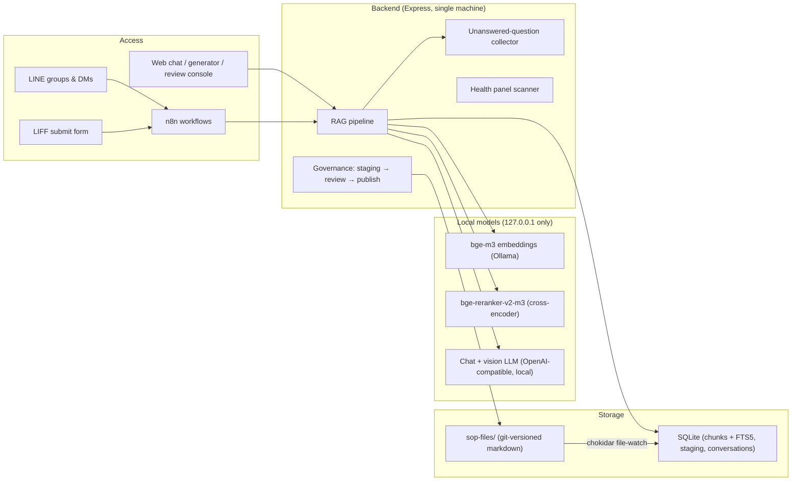

# 📚 local-sop-assistant

**A fully local, on-prem SOP knowledge assistant** — turn your team's standard operating procedures into a natural-language Q&A system that runs entirely on one machine. Zero cloud. Built-in submit → review → publish governance. Optional LINE bot for leave requests, handovers, and SOP Q&A.

[🇹🇼 繁體中文版 README](./README.zh-TW.md)

> This repo is a **deployable system**, not just documentation. All real secrets / tokens / internal IPs / real documents have been replaced with `<placeholders>`. Follow [INSTALL.md](./INSTALL.md) to bring it up on your own machine.

---

## Why build this

Internal SOPs contain **sensitive company data** — procedures, contact persons, internal system details — that should never be sent to a cloud LLM. At the same time, the SOPs lived in Word files and paper binders: new hires asked the same questions every week, and nobody knew which document was the current one.

So instead of a SaaS chatbot, this is:

- **100% local inference** — chat model, embeddings, and reranker all run on one Mac Mini. Nothing leaves the building.
- **Honest by design** — if the knowledge base doesn't contain the answer, it says so. It never improvises procedures.
- **Governed, not a wiki dump** — every document enters through a submit → human review → publish pipeline, so the bot only ever quotes approved content.
- **Self-improving loop** — questions the bot *couldn't* answer are collected for human triage, becoming the to-write list for next batch of docs.

## A day with it

- 9:02 — a teammate messages the LINE bot: `/sop how do I book the big meeting room?` The bot retrieves the *Meeting-Room Booking* SOP and answers with sources. Follow-up questions need no `/sop` prefix — the session stays open for 10 minutes.
- 9:15 — someone snaps a photo of a paper leave slip into the group chat. The vision model reads the name, dates and "total 2 days 0 hours", registers 16 hours of leave, and replies with a confirmation.
- 11:40 — a colleague types "Mei taking 1 hour off, slip to follow" — the bot registers it as pending; when the slip photo arrives later, the same record is auto-confirmed with the real leave type. No duplicates.
- 17:30 — the department lead opens the review console, approves two submitted SOPs (they go live instantly via file-watcher reindexing), and checks the *health panel* for duplicate or contradicting documents.
- Weekly — the *unanswered questions* list tells the team exactly which SOPs are missing or unfindable.

## Capabilities

| Domain | What it does |
|---|---|
| 🔍 **SOP Q&A** | Natural-language questions over the whole knowledge base — web chat and LINE. Hybrid retrieval (vector + keyword) survives sloppy phrasing, typos-with-punctuation, and jargon. Every answer carries a live confidence badge (semantic-search hit count, click for per-document relevance %) and a side panel showing the exact source excerpts it was grounded on. |
| 🧰 **Personal workspace** | The chat page doubles as a lightweight personal dashboard alongside the SOP assistant: notes, a to-do/schedule tab, a contacts book, and a quick-links shelf — plus a **free-chat mode** for non-SOP questions. All personal-tool data lives in the browser's own local storage; nothing personal is sent to or stored on the server. |
| 📂 **In-chat document management** | Browse the live document list, open any source file, or open the same in-place SOP editor used by the review console — submit for review or (with the review password) update directly. Request-deletion and direct-delete flows included. |
| 🙅 **Honest no-answer** | Dual-signal relevance gate. Below threshold → *"I don't have this in my documents, please ask your supervisor"* — never a hallucinated procedure. |
| 📥 **Unanswered collection** | Every no-answer question is logged (with candidate docs) for human triage: *missing document* vs *retrieval miss*. Feeds the documentation backlog. |
| ✍️ **Authoring studio** | Step-wizard for two document types (7-section full SOP / lightweight reference doc), or **AI quick-build**: describe the process in plain words and the local LLM interviews you — 5-8 targeted questions (all editable) covering purpose, actors, steps, caveats and FAQ — then structures your answers through the same 7-section template as manual mode. Per-step screenshot attachments, one-click **AI-generated FAQ** (10 colloquial questions from how/where/when/what-if angles), autosaved drafts, live markdown preview. |
| 🤖 **Agent-readiness audit** | Before a document can be generated, an AI review gate scans it for exactly what breaks execution later: vague words ("asap", "the responsible person"), steps missing a system name or path, no success criteria, exception handling that just says "contact the manager" — tiered as ❌ must-fix vs ⚠️ suggestion. A companion **Agent-Ready converter** retrofits legacy documents into agent-executable format, marking unrecoverable gaps as `[to-be-filled]` for human completion. |
| ✅ **Review governance** | Password-protected review console. Submissions wait in SQLite staging; approval publishes the markdown into the git-versioned corpus and triggers automatic reindexing. |
| 🩺 **Health panel** | Scheduled corpus scan: near-duplicate detection (embedding similarity with evidence segments), contradiction candidates, broken cross-references. |
| 📅 **LINE attendance bot** (optional) | Leave register / query / modify / cancel in natural Chinese, paper-slip **OCR via a local vision model**, handover records with automatic agent (deputy) forwarding, morning duty report, member binding with whitelist gate. |

## Screenshots

> All screenshots below run on the real UIs with **demo data** — no real documents, names, or credentials.

**Review console** — pending queue with AI pre-check badges, side-by-side diff of a modification, one-click approve / reject:


**Web Q&A + personal workspace** — the chat page itself: semantic-search confidence badge with per-document relevance %, a live source panel, and a personal-tools sidebar (notes / to-do & schedule / contacts / quick links, all local-storage only — never sent to the server):


**LINE** — `/sop` Q&A with sticky follow-up session (left); attendance bot registering leave, confirming a photographed slip via OCR, and answering queries (right):

| LINE `/sop` Q&A | LINE attendance bot |
|---|---|
|  |  |

**The LINE attendance bot's actual n8n workflow** — 57 nodes: webhook intake → image/text branch → OCR slip parsing with dedup-and-merge, `/sop` fast-path, the natural-language leave agent, handover routing, and scheduled jobs for daily digest and cleanup (IDs/tokens redacted):



**SOP generator, AI quick-build** — describe a process in plain words; the local LLM interviews you for exactly what a newcomer would get stuck on, then assembles the document:


**SOP generator, agent-readiness audit** — the AI review gate before a document ships: vague wording, missing paths, and absent success criteria get flagged as must-fix or suggestion:


## Architecture



### The retrieval pipeline (the heart)

1. **Normalize** the query (punctuation/whitespace) so vector, keyword and reranker all see the same bytes.
2. **Two retrievers in parallel** — dense vectors (bge-m3 cosine) and **FTS5 trigram keyword search** (catches exact jargon like form names that embeddings blur).
3. **RRF fusion** (`K = 60`) merges both rankings — vector-led, keyword-reinforced.
4. Top-20 candidates go to a **cross-encoder reranker**, each prefixed with `document title | section title` so near-twin documents are distinguishable.
5. **Dual-signal gate** decides *answer vs honest no-data*:
   - top rerank score ≥ **0.1** → feed rerank-approved chunks (true positives score ≥ 0.19, lexical-overlap noise ~0.02)
   - else top cosine ≥ **0.60** → rescue for extreme paraphrases
   - else → fixed no-data reply, **the LLM is never called** (honesty can't be prompt-injected away)
   - reranker service down → graceful fallback to pure cosine (the system degrades, never breaks)
6. Gate-approved chunks pull in **whole-document context**, and the local chat model answers with source citations.

## Correctness engineering

Things that broke in production and are now structural guarantees:

- **Bare-query-first contextualization.** LINE follow-up mode used to merge the previous question into the retrieval query — a fully self-contained question could be *poisoned* by an unrelated previous topic (rerank score collapsed 0.52 → 0.01, "sometimes it knows, sometimes it doesn't"). Now retrieval always runs on the bare question first; the merged contextual query is only used as a **rescue when the bare query finds nothing**. Contextualization can turn *no-data into hit*, never *hit into no-data*.
- **Reranker resilience under load.** Concurrent GPU bursts could push the reranker past its timeout, silently downgrading the gate to a stricter cosine threshold — flipping 3/47 eval answers. Fixed with a load-calibrated timeout plus one retry on transient errors; burst-tested to zero silent downgrades.
- **Eval-gated changes.** A 46-case regression suite (positive hits, twin-document disambiguation, honest-negative questions) must not regress before any retrieval change ships.
- **Attendance dedup that matches reality.** A duplicate is *same person + overlapping dates + combined hours > 8* — leave-type is deliberately ignored (a slip may say 特休 where the chat said 遞延特休), and two half-days on one date coexist.
- **OCR reads the slip like a clerk.** "共X天Y時" (total days/hours) on the slip is authoritative; end-times like `17:45` can never be misread as *17 hours*; day-spans are recomputed from workdays, skipping weekends and holidays.

## Editions

| Edition | Contents | Directories |
|---|---|---|
| **Core** (no LINE) | Web Q&A + review console + generator + health panel | `core/` |
| **+ LINE Q&A** | Core **+** ask SOPs over LINE (Q&A only) | `core/` + `line-sop-qa/` |
| **Full** (attendance) | Core **+** LINE leave/handover/agent bot (with `/sop` Q&A) | `core/` + `line-attendance/` |

## Repo layout

```
local-sop-assistant/
├── INSTALL.md             # ⭐ step-by-step install (local models → backend → review console → n8n → LINE)
├── docs/                  # design docs: ARCHITECTURE / MODELS / GOVERNANCE / HEALTH_PANEL / DECISIONS
├── core/                  # [Core] the knowledge base itself
│   ├── server/            # Express + better-sqlite3 + chokidar + the RAG pipeline
│   ├── web/index.html     # Q&A chat page (end-user interface)
│   ├── admin/review.html  # review console (incl. health panel + unanswered-questions tab)
│   ├── generator/         # SOP generator + Agent-Ready converter front-ends
│   ├── reranker/          # local reranker micro-service (Python)
│   ├── launchd/           # macOS always-on service templates
│   └── .env.example       # every config knob (placeholders)
├── line-sop-qa/           # [+LINE Q&A] n8n flow, Q&A only
└── line-attendance/       # [Full] LINE leave / handover / agent bot + LIFF submit form
```

## Performance (measured, single user)

Median end-to-end on one Mac Mini: **~3.6 s** — embedding 138 ms, rerank 0.8 s, generation (incl. prefill) ~2.5 s. Retrieval bookkeeping (vector scan + FTS + fusion + gate) is ~5 ms; >95 % of latency is model inference, by design running on local hardware.

## Privacy & security

- No real secrets in the repo — `.env` and `.review-password` are gitignored; everything sensitive is a `<placeholder>`.
- SOP content may contain personal data → **local-only inference, LAN-only serving**; cloud LLMs are never called.
- Review actions are password-gated; LINE DMs are whitelist-gated (unbound users get silence, not a hint).

## Quick start

→ **[INSTALL.md](./INSTALL.md)** — local models → backend → review console → (optional) n8n + LINE.
