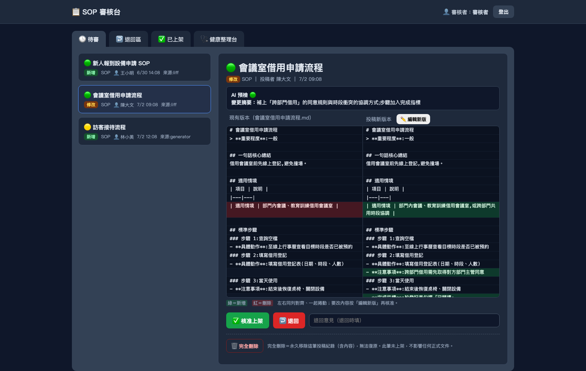
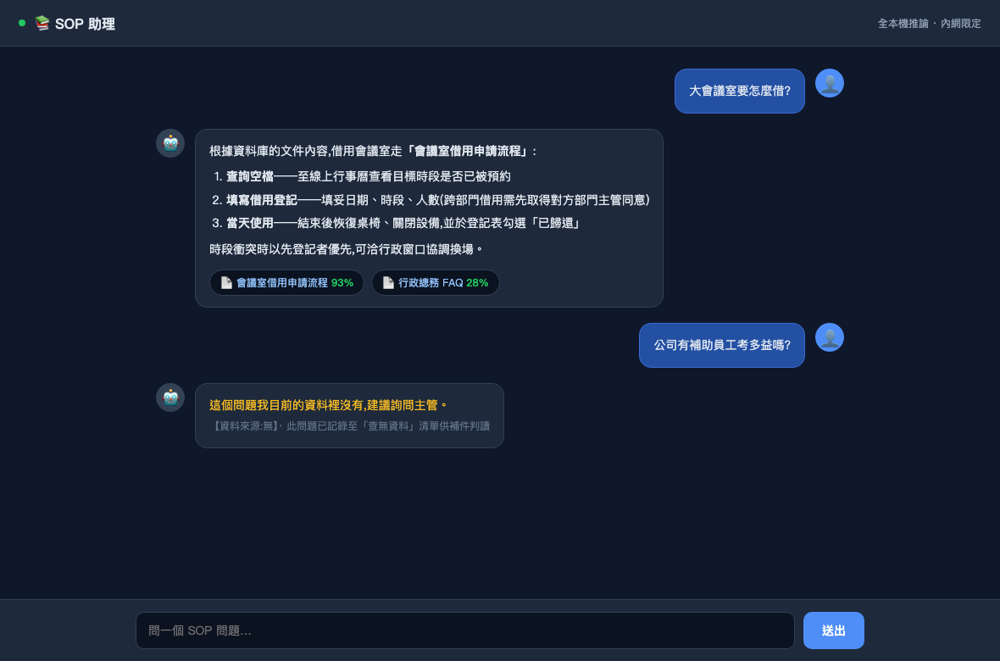
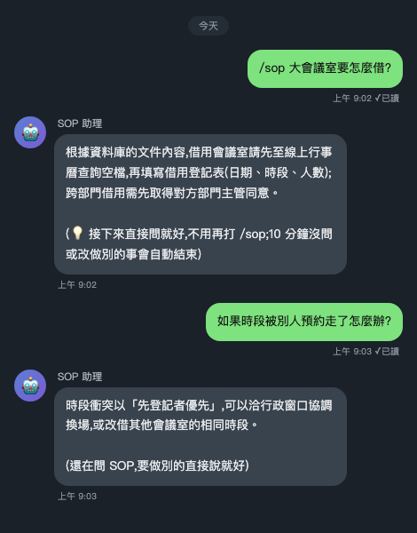
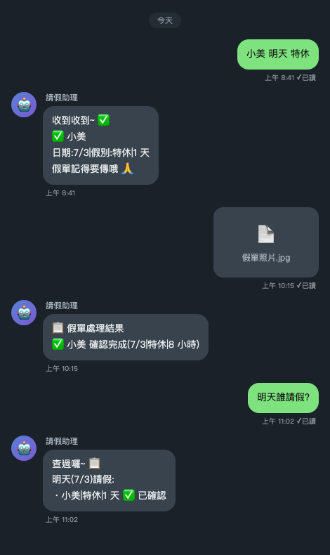
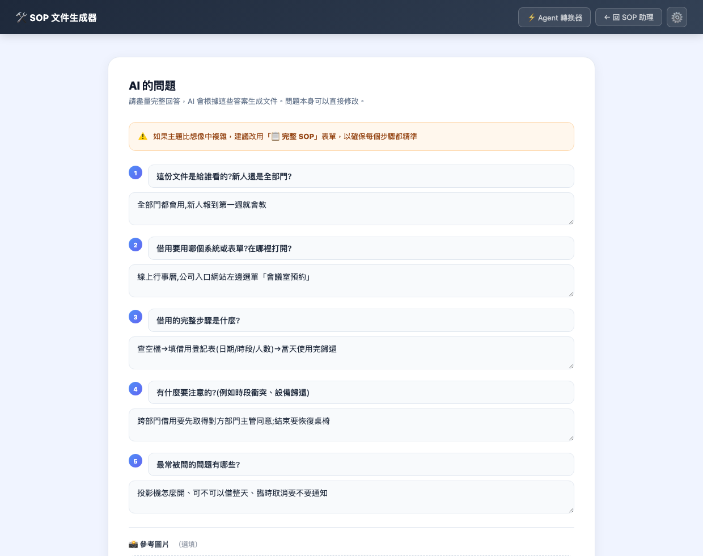
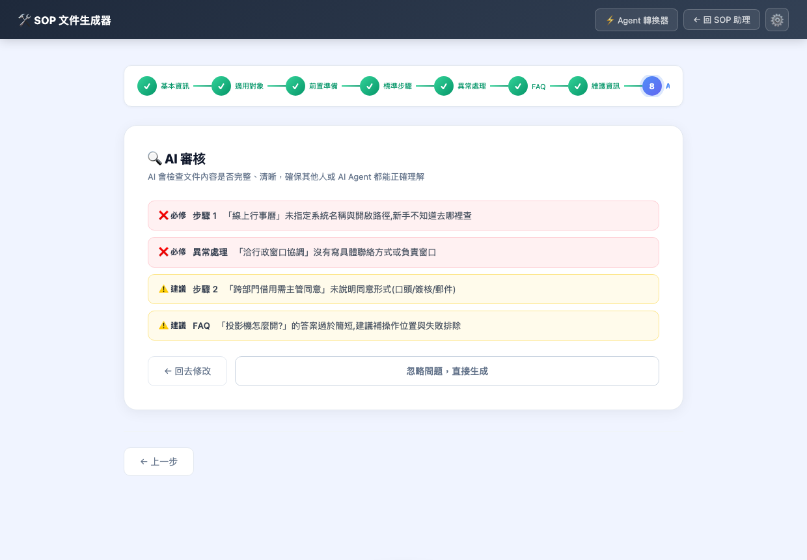
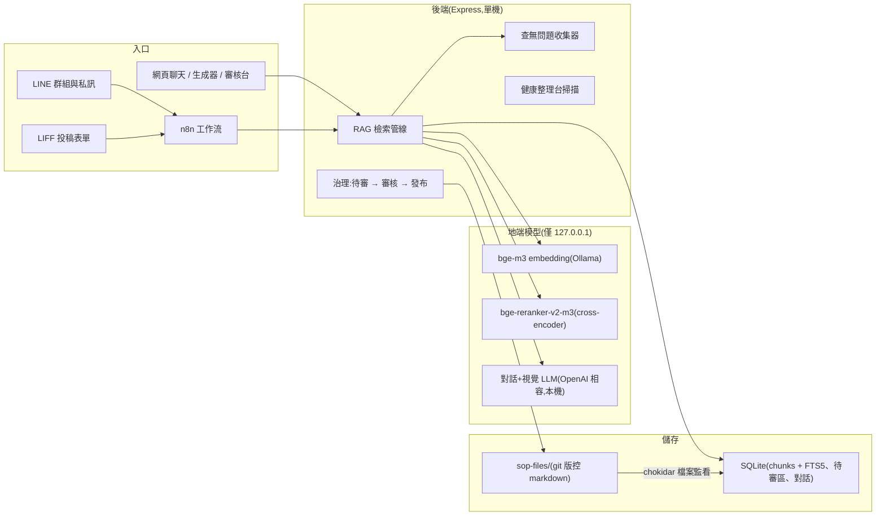

# 📚 local-sop-assistant

**全本機、內網限定的部門 SOP 知識庫助理**——把團隊的標準作業流程做成能用自然語言問答的系統,整套跑在一台機器上,**完全不經雲端**。內建「投稿 → 審核 → 發布」治理流程,可選配 LINE 請假/交接/SOP 問答機器人。

[🇺🇸 English README](./README.md)

> 這個 repo 是**可直接部署的完整系統**,不是只有文件。所有真實密鑰 / token / 內網 IP / 真實文件內容都已抽掉、換成 `<佔位符>`;照 [INSTALL.md](./INSTALL.md) 裝好地端模型、填上自己的值即可上線。

---

## 為什麼做這個

內部 SOP 含有**公司敏感資料**——作業流程、聯絡窗口、內部系統細節——這些不該送給雲端 LLM。但同時,SOP 散落在 Word 檔和紙本資料夾裡:新人每週問一樣的問題,沒人知道哪份文件才是現行版。

所以這不是又一個 SaaS 聊天機器人,而是:

- **100% 地端推論**——對話模型、embedding、reranker 全部跑在一台 Mac Mini 上,資料不出辦公室。
- **誠實是設計出來的**——知識庫裡沒有的,就明說沒有,絕不憑空編一套流程。
- **有治理,不是 wiki 垃圾場**——每份文件都要走「投稿 → 人工審核 → 發布」,機器人只會引用審核過的內容。
- **會自己變完整**——答不出來的問題會被收集起來供人工判讀,直接變成下一批要補寫的文件清單。

## 它的一天

- 9:02——同事私訊 LINE 機器人:`/sop 大會議室要怎麼借?`機器人檢索到《會議室借用申請流程》,附來源作答。接下來追問不用再打 `/sop`,對話視窗保持 10 分鐘。
- 9:15——有人把紙本假單拍照丟進群組。視覺模型讀出姓名、日期和「共 2 天 0 時」,自動登記 16 小時的假,回覆確認訊息。
- 11:40——同事打「小美 請休一小時,假單進公司後送出」——機器人先登記為待假單;稍後假單照片進來,同一筆自動補上真正假別並確認,不會變成兩筆。
- 17:30——主管打開審核台,核准兩份投稿的 SOP(檔案監看器即時重建索引、立刻生效),順便看一眼「健康整理台」有沒有重複或互相矛盾的文件。
- 每週——「查無資料問題清單」告訴團隊:哪些 SOP 還沒寫、哪些是搜尋沒命中。

## 功能總覽

| 領域 | 做什麼 |
|---|---|
| 🔍 **SOP 問答** | 用自然語言問整個知識庫——網頁聊天與 LINE 都行。混合檢索(向量+關鍵字)扛得住口語贅字、標點差異和專有名詞。 |
| 🙅 **誠實查無** | 雙訊號相關性閘門。沒過門檻 → 「這個問題我目前的資料裡沒有,建議詢問主管」——絕不幻覺出一套流程。 |
| 📥 **查無問題收集** | 每個答不出來的問題都被記錄(附候選文件)供人工判讀:是「真的沒這份文件」還是「搜尋沒命中」,直接餵進補文件的待辦清單。 |
| ✍️ **文件撰寫工作台** | 兩種文件類型的步驟精靈(7 大區塊完整 SOP / 輕量資訊參考文件),或 **AI 快速建立**:用白話描述流程,本機 LLM 反問你 5-8 個針對性問題(可直接改題目)——涵蓋用途、對象、步驟、注意事項、常見問題——再把回答結構化,走跟手動模式同一套 7 段模板組裝。每個步驟可貼操作截圖、一鍵 **AI 生成 FAQ**(10 題口語化提問,涵蓋怎麼做/在哪裡/什麼時候/失敗怎辦)、草稿自動保存、即時 markdown 預覽。 |
| 🤖 **Agent-Ready 審核** | 文件生成前有一道 AI 審核閘門,專抓「之後會害執行失敗」的問題:模糊詞(盡快、相關人員)、步驟沒寫系統名稱或路徑、沒有完成判準、異常處理只寫「聯絡主管」——分級為 ❌ 必修與 ⚠️ 建議。另附 **Agent-Ready 文件轉換器**:把舊的人寫文件改造成 AI Agent 可執行的格式,補不出來的資訊標 `[待補全]` 留給人工。 |
| ✅ **審核治理** | 密碼保護的審核台。投稿先進 SQLite 待審區;核准後 markdown 發布進 git 版控的文件庫,自動觸發重建索引。 |
| 🩺 **文件健康整理台** | 定期掃描文件庫:近似重複偵測(embedding 相似度+證據段落)、矛盾候選、斷掉的交叉引用。 |
| 📅 **LINE 出勤機器人**(選配) | 中文自然語言請假登記/查詢/修改/取消、紙本假單**本機視覺模型 OCR**、交接紀錄自動轉發代理人、每日早報、綁定白名單閘門。 |

## 畫面

> 以下截圖都是**真實 UI 跑示範資料**——沒有任何真實文件、姓名或密鑰。

**審核台**——待審清單附 AI 預檢標記、修改投稿的左右 diff 對照、一鍵核准/退回:



**網頁問答**——回答附來源文件與相關分數;範圍外的問題誠實說「資料裡沒有」並記錄供補件判讀:



**LINE**——`/sop` 問答含連續追問(左);出勤機器人登記請假、OCR 確認假單照片、回答查詢(右):

| LINE `/sop` 問答 | LINE 出勤機器人 |
|---|---|
|  |  |

**SOP 生成器・AI 快速建立**——用白話描述流程,本機 LLM 針對「新手會卡住的地方」反問你,再自動組裝文件:



**SOP 生成器・Agent-Ready 審核**——文件出爐前的 AI 審核閘門:模糊詞、缺路徑、缺完成判準,分級標成必修/建議:



## 架構



### 檢索管線(系統的心臟)

1. **正規化**查詢(標點/空白),讓向量、關鍵字、reranker 三路看到相同位元組。
2. **兩路檢索並行**——密集向量(bge-m3 cosine)與 **FTS5 trigram 關鍵字檢索**(專抓 embedding 會模糊掉的表單名稱等專有名詞)。
3. **RRF 融合**(`K = 60`)合併兩路排名——向量主導、關鍵字補強。
4. 前 20 名候選送進 **cross-encoder reranker** 精排,每條前綴「文件標題|章節標題」,雙胞胎文件也分得出來。
5. **雙訊號閘門**決定「作答 vs 誠實查無」:
   - 最高 rerank 分 ≥ **0.1** → 餵 rerank 認可的 chunk(真陽性通常 ≥ 0.19,字面沾邊的雜訊只有 ~0.02)
   - 否則最高 cosine ≥ **0.60** → 救「換句話問」的極端案例
   - 都沒過 → 固定查無訊息,**根本不呼叫 LLM**(誠實度無法被 prompt 繞過)
   - reranker 服務掛掉 → 優雅退回純 cosine(系統只降級、不中斷)
6. 過閘的 chunk 帶入**整份來源文件**當上下文,本機對話模型附來源作答。

## 正確性工程

這些是在真實上線中踩過、現在變成結構性保證的坑:

- **裸句優先的追問脈絡化。** LINE 追問模式原本會把上一題合併進檢索字串——一句語意完整的問題可能被無關的前題「污染」(rerank 分數從 0.52 崩到 0.01,「同一句時好時壞」)。現在一律先用裸句檢索;合併句只在**裸句查無時才拿來救援**。脈絡化只能把「查無」變「命中」,永遠不能把「命中」變「查無」。
- **高負載下的 reranker 韌性。** GPU 併發尖峰曾讓 reranker 超時,閘門靜默降級成更嚴的 cosine 門檻——47 題 eval 翻掉 3 題。修法:依實際負載校準的逾時+暫時性錯誤重試一次;壓測驗證零靜默降級。
- **改動一律過 eval 才上。** 46 題回歸測試集(正向命中、雙胞胎文件辨析、誠實負向題),檢索相關的改動不退步才能發布。
- **符合現實的請假判重。** 重複的定義是「同人+日期重疊+時數相加 > 8」——刻意不看假別(假單寫特休、口頭說遞延特休是同一筆),同一天兩個半天假可以並存。
- **OCR 像行政人員一樣讀假單。**「共X天Y時」是權威欄位;`17:45` 這種結束時間永遠不會被誤讀成「17 小時」;跨日天數用工作日重算,自動跳過週末與國定假日。

## 三種版本(自己選一個裝)

| 版本 | 內容 | 目錄 |
|---|---|---|
| **基本版**(無 LINE) | 網頁問答 + 審核台 + 生成器 + 健康整理台 | `core/` |
| **+ LINE 問答** | 基本版 **+** 用 LINE 問 SOP(純問答) | `core/` + `line-sop-qa/` |
| **完整版**(含請假) | 基本版 **+** LINE 請假/交接/代理人機器人(含 `/sop` 問答) | `core/` + `line-attendance/` |

## 目錄結構

```
local-sop-assistant/
├── INSTALL.md             # ⭐ 一步一步安裝指南(地端模型→後端→審核台→n8n→LINE)
├── docs/                  # 設計文件:ARCHITECTURE / MODELS / GOVERNANCE / HEALTH_PANEL / DECISIONS
├── core/                  # 【基本版】知識庫本體
│   ├── server/            # Express + better-sqlite3 + chokidar + RAG 管線
│   ├── web/index.html     # 問答聊天頁(使用者介面)
│   ├── admin/review.html  # 審核台(含健康整理台 + 查無資料判讀分頁)
│   ├── generator/         # SOP 生成器 + Agent-Ready 轉換器前端
│   ├── reranker/          # 本機 reranker 小服務(Python)
│   ├── launchd/           # macOS 常駐服務範本
│   └── .env.example       # 所有設定項(佔位符)
├── line-sop-qa/           # 【+LINE問答】純問答 n8n flow
└── line-attendance/       # 【完整版】LINE 請假/交接/代理人 + LIFF 投稿表單
```

## 效能(實測,單人)

一台 Mac Mini 上端到端中位數 **~3.6 秒**——embedding 138ms、rerank 0.8s、生成(含 prefill)~2.5s。檢索本身的純程式開銷(向量掃描+FTS+融合+閘門)只有 ~5ms;95% 以上的延遲是模型推論——這是「全部跑在自己硬體上」的設計代價,也是隱私的價格。

## 隱私與安全

- repo 內**不含任何真實密鑰**;`.env` 與 `.review-password` 已在 `.gitignore`,敏感值全是 `<佔位符>`。
- SOP 內容可能含個資 → **推論全本機、服務只綁內網**;雲端 LLM 一律不碰。
- 審核操作需密碼;LINE 私訊有白名單閘門(未綁定的人得到的是沉默,不是提示)。

## 開始安裝

→ **[INSTALL.md](./INSTALL.md)**——地端模型 → 後端 → 審核台 →(選配)n8n + LINE。
